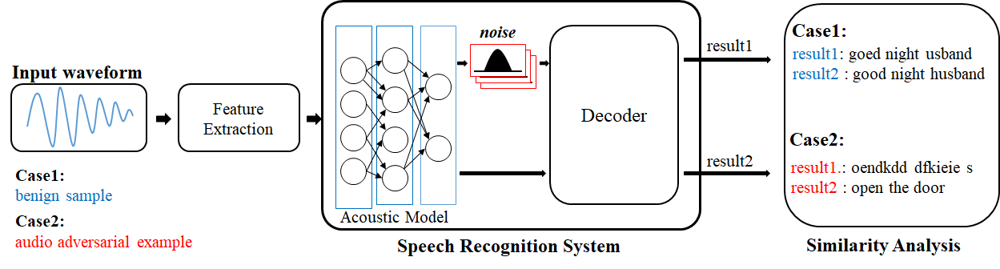
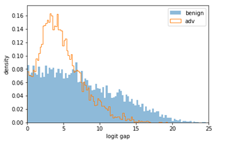
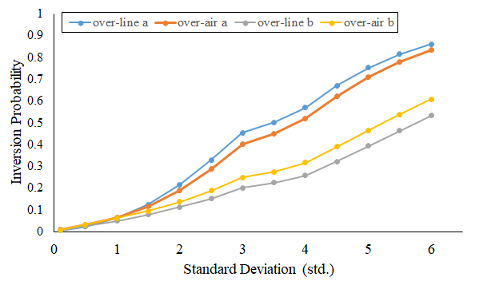

### Detecting_Audio_Adversarial_Examples_With_Logit_Noising

This repository contains code of ACSAC 2021 paper "Detecting Audio Adversarial Examples with Logit Noising".

In thi repository, we upload Det_DeepSpeech.py, logit_analysis_ACSAC.ipyb, and audio samples (attacks and original)

#### Det_DeepSpeech.py

In this file, we generate multiple Gaussian noises and add them to the result of acoustic model in the ASR system (called logits). 
Each logits sequence is transcribed to character-level transcription using beam-search decoding. After that, we calculate the Character Error Rate (CER) for original logits transcription and each noised logits transcription. Finally, the sum of each CER is over than threshold, we consider it an attack. Below figure is overall architecture we proposed.



#### logit_analysis_ACSAC.ipyb

For generating robust detection system, we select appropriate noise distribution. 
This file help us to calculate the 1-k logit-gap distribution and 1-k inversion probability.




Finally, using 1-k inversion probability, we can caculate total inversion probability


To execute our detection system, you have to install a native_client file[native_client]https://github.com/mozilla/DeepSpeech/blob/v0.1.1/native_client/README.md
However, the artifact expired, we should rebuid it. 

Enter the DeepSpeech original github site [DeepSpeech_v0.1.1]https://github.com/mozilla/DeepSpeech/tree/v0.1.1
You can install deepspeech by following the steps from the link above.

If you rebuild DeepSpeech v0.1.1 execute det_DeepSpeech.py
```
python3 python -u Detect_DeepSpeech.py --train_files "$any_file" --dev_files "$any_file" --test_files "$any_file" \
  --train_batch_size 1 \ --dev_batch_size 1 \ --test_batch_size 1 \  --n_hidden 2048 \ --epoch 1 \ --checkpoint_dir "$checkpoint_dir" \
```
